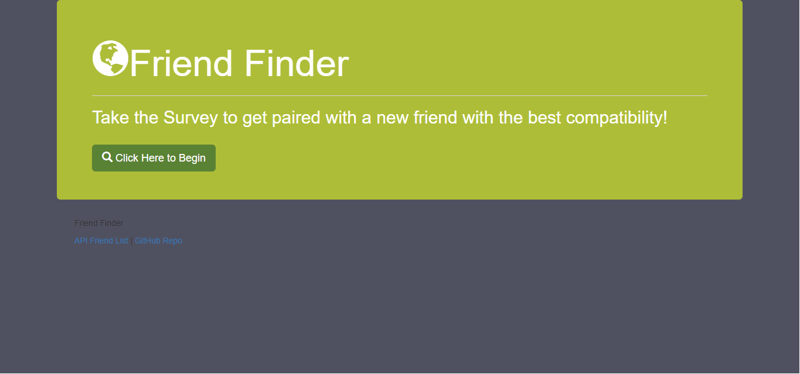
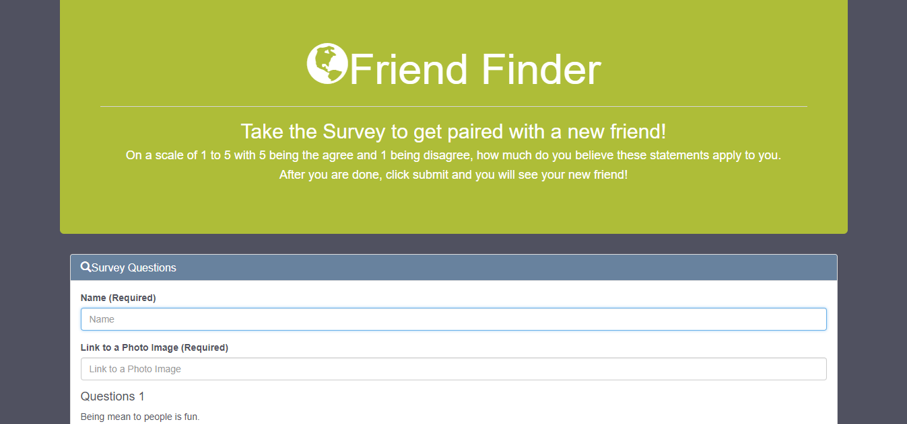

# FriendFinders

This is an application that allows the user to fill out a survey that will match them with a new friend. The user is matched with someone who has also taken the survey and has answered the questions similarily to them. 

 

## Using the Application

After the user clicks the button to take the survey, they are taken to the survey page where they need to add their name and a photo of themselves. They are then supposed to anwser the 10 questions, matching how much the agree with the statement (with 5 being extremely agree and 1 being extremely disagree).

 

When the user is finished filling out the survey they are to hit submit. When the user hits submit a modal come up with their new friend match!

 

## Matching Process

Once the user hits submit their answers are pull from the drop down using JQuery. The answers are then put into an array. That array is then subtracted question by question from the answer array of every other person who has participated in the survey.

Once those scores are subtracted they are added together into a total difference score. The person that has the smallest difference score from the new user is that new users match.

All of the existing friends in the application are stored in a JSON and are pulling into the front end of the application using AJAX calls.

 

For full demonstration of application see video in app/public/img folder.

## Languages and Packages Used

This application uses HTML, CSS, Bootstrap, JavaScript, JQuery, and mySQL.

The npm packages used are Express, mysql, and Body-Parser.

